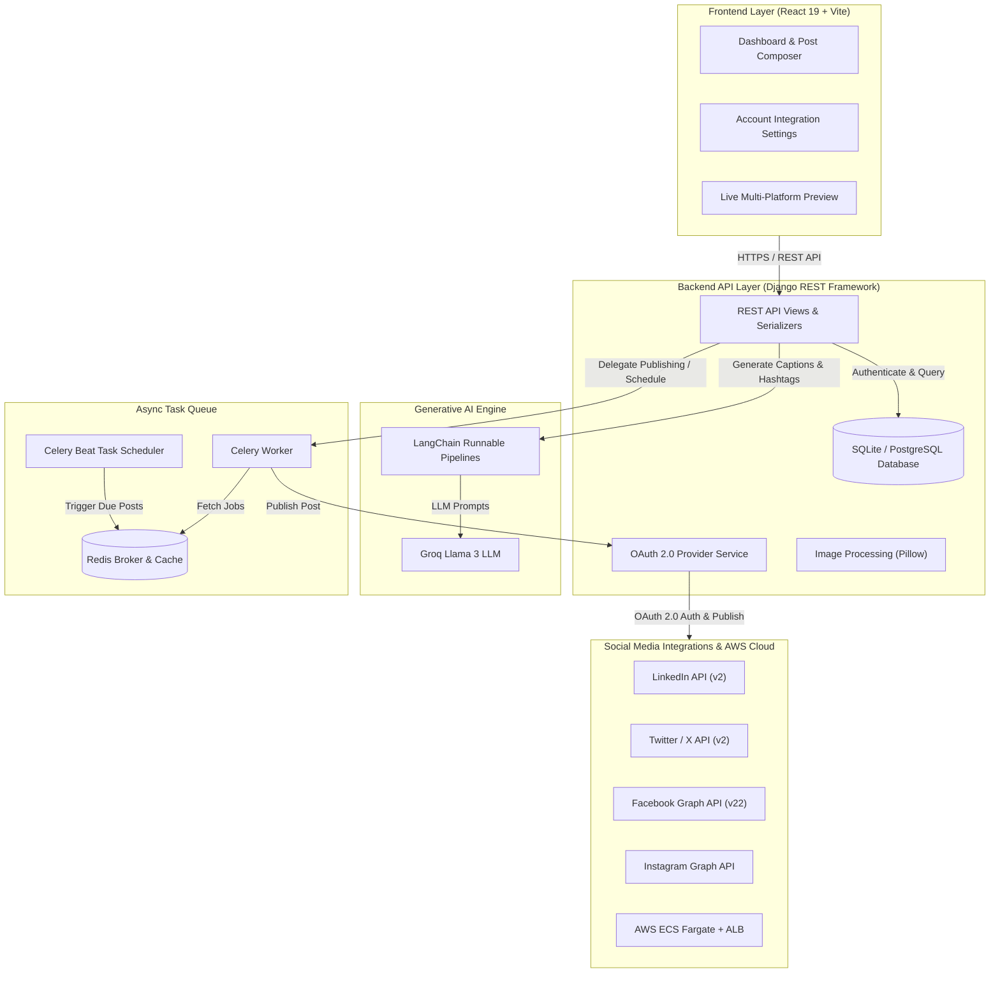

# SocialMediaAI — AI Social Media Command Center

An end-to-end, enterprise-grade AI content generation, multi-platform publishing, and post scheduling system built with **React 19**, **Django REST Framework**, **LangChain**, **Groq Llama 3**, **Celery**, **Redis**, and **AWS ECS Fargate**.

---

##  Table of Contents

- [Overview](#-overview)
- [Key Features](#-key-features)
- [System Architecture & Data Flow](#-system-architecture--data-flow)
- [Technology Stack](#-technology-stack)
- [Design Patterns & Engineering Techniques](#-design-patterns--engineering-techniques)
- [Project Directory Structure](#-project-directory-structure)
- [Getting Started & Local Setup](#-getting-started--local-setup)
- [Environment Variables Reference](#-environment-variables-reference)
- [API Endpoints Reference](#-api-endpoints-reference)
- [AWS CI/CD Cloud Deployment](#-aws-cicd-cloud-deployment)
- [License & Author](#-license--author)

---

##  Overview

**SocialMediaAI** enables content creators, digital marketers, businesses, and social media managers to generate, edit, preview, schedule, and publish optimized social media posts across **Twitter/X**, **LinkedIn**, **Facebook**, and **Instagram** from a single intelligent dashboard.

By combining Large Language Models (LLM) with prompt engineering, SocialMediaAI creates platform-customized content adapted to character limits, visual structures, hashtag strategies, and tone variations.

---

##  Key Features

- ** AI-Powered Content Generation**: Multimodal prompt and image ingestion powered by LangChain and Groq Llama 3 models.
- **📱 Live Multi-Platform Previews**: Side-by-side post editing and interactive rendering tailored for LinkedIn, Twitter/X, Facebook, and Instagram.
- **OAuth 2.0 Integration**: Secure social media account authentication utilizing the **Factory & Provider Design Pattern**.
- **Instant & Scheduled Publishing**: Publish posts immediately or schedule future dispatches using **Celery background workers** and **Redis broker**.
- **Analytics & Post History**: Track published, pending, and failed posts with detailed execution status.
- **Automated AWS CI/CD Pipeline**: Multi-stage Docker build pipeline deployed to **AWS ECS Fargate** with **Application Load Balancer (ALB)** and **GitHub Actions**.

---

##  System Architecture & Data Flow



---

##  Technology Stack

| Layer | Component | Technologies |
| :--- | :--- | :--- |
| **Frontend** | Framework & UI | React 19, Vite 8, React Router v7, Tailwind CSS v4, React Icons, React Hot Toast |
| **Backend** | REST API & Core | Python 3.11, Django 5.2, Django REST Framework, Django CORS Headers, WhiteNoise |
| **Authentication** | User Security | SimpleJWT (JSON Web Tokens), Session Authentication |
| **Generative AI** | LLM Engine | LangChain, LangChain Groq, Groq Llama 3 Models, Prompt Templates |
| **Async Tasks** | Queue & Scheduling | Celery 5.6, Redis 7 (Message Broker & Result Backend) |
| **Database** | Data Storage | SQLite 3 (Dev), PostgreSQL / `dj-database-url` (Production) |
| **Containerization** | DevOps | Multi-Stage Dockerfile (Node 20 Alpine + Python 3.11 Slim), Docker Compose |
| **AWS Cloud** | Infrastructure | AWS ECS Fargate, AWS ECR, AWS Application Load Balancer (ALB), AWS Secrets Manager, GitHub Actions |

---

##  Design Patterns & Engineering Techniques

### 1. Factory & Provider Design Pattern (OAuth Architecture)
The OAuth implementation isolates platform-specific authentication details using the Factory & Provider Pattern:
- `BaseOAuthProvider`: Abstract base class enforcing interface methods (`generate_login_url`, `exchange_code`, `get_user_profile`, `publish_post`).
- Concrete Providers: `LinkedInProvider`, `TwitterProvider`, `FacebookProvider`, `InstagramProvider`.
- `OAuthFactory`: Instantiates and retrieves the appropriate provider dynamically at runtime.

### 2. Service Layer Architecture
Business logic is decoupled from HTTP controllers into reusable service modules:
- `LLMService`: Ingests prompts and initializes Groq LLM pipelines.
- `PublishService`: Coordinates post dispatching across social channels.
- `ScheduleService`: Manages post states (`PENDING`, `PUBLISHED`, `FAILED`).

### 3. LangChain Runnable Pipelines
Prompts and output parsers are chained into composable Runnable pipelines that automatically transform raw prompts into platform-formatted text (Twitter 280-character limit, LinkedIn professional tone, Instagram hashtag blocks).

### 4. Multi-Stage Docker Build
- **Stage 1 (`node:20-alpine`)**: Builds the compiled React single-page application (`dist`).
- **Stage 2 (`python:3.11-slim`)**: Copies the frontend build into `backend/frontend_dist`, collects static files via WhiteNoise, and runs the Gunicorn WSGI web server.

---

##  Project Directory Structure

```text
SocialMediaAI/
├── backend/
│   ├── config/              # Django Settings, URLs, Celery, WSGI/ASGI
│   ├── core/                # Data Models, Views, Serializers, Celery Tasks
│   ├── oauth/               # Provider Factory & OAuth Implementation
│   │   ├── providers/       # LinkedIn, Twitter, Facebook, Instagram Providers
│   │   ├── oauth_factory.py
│   │   └── oauth_service.py
│   ├── prompts/             # LangChain Prompt Templates
│   ├── runnables/           # LangChain Runnable Pipelines
│   ├── services/            # LLM, Caption, Hashtag, Publish & Schedule Services
│   ├── frontend_dist/       # Production Frontend Compiled Assets
│   ├── manage.py
│   └── requirements.txt
│
├── frontend/
│   ├── src/
│   │   ├── components/      # Navbar, PostComposer, LivePreview, PlatformSelector
│   │   ├── pages/           # Dashboard, History, Settings, Analytics
│   │   ├── api/             # Axios API Client Instance
│   │   ├── App.jsx
│   │   └── index.css        # Custom Design System
│   ├── package.json
│   └── vite.config.js
│
├── .github/workflows/       # GitHub Actions AWS ECS Deployment Pipeline
├── Dockerfile               # Production Multi-Stage Docker Build
├── docker-compose.yml       # Local Development Orchestration
├── task-def-latest.json     # AWS ECS Task Definition
└── README.md
```

---

##  Getting Started & Local Setup

### Prerequisites
- Python 3.11+
- Node.js 20+ & npm
- Redis Server (or Docker)

### 1. Clone Repository
```bash
git clone https://github.com/vyshnavivissa/SocialMediaAI.git
cd SocialMediaAI
```

### 2. Backend Setup
```bash
# Create and activate virtual environment
python -m venv venv
# On Windows:
venv\Scripts\activate
# On Linux/macOS:
source venv/bin/activate

# Install dependencies
cd backend
pip install -r requirements.txt

# Run migrations and start backend server
python manage.py migrate
python manage.py runserver 8000
```

### 3. Frontend Setup
```bash
cd ../frontend
npm install
npm run dev
```

### 4. Access Application
- **Frontend SPA**: `http://localhost:5173/`
- **Backend API**: `http://localhost:8000/api/`

---

##  Environment Variables Reference

Create a `.env` file in the `backend/` directory:

| Variable | Description | Example / Value |
| :--- | :--- | :--- |
| `SECRET_KEY` | Django Secret Key | `super-secret-key-for-dev` |
| `DEBUG` | Debug Mode Flag | `True` |
| `GROQ_API_KEY` | Groq API Key for Llama LLM | `gsk_...` |
| `LINKEDIN_CLIENT_ID` | LinkedIn OAuth Client ID | `77upzkws2i9m1m` |
| `LINKEDIN_CLIENT_SECRET` | LinkedIn OAuth Client Secret | `...` |
| `LINKEDIN_REDIRECT_URI` | LinkedIn OAuth Callback URL | `http://127.0.0.1:8000/oauth/linkedin/callback/` |
| `TWITTER_CLIENT_ID` | Twitter / X OAuth Client ID | `...` |
| `TWITTER_CLIENT_SECRET` | Twitter / X OAuth Client Secret | `...` |
| `TWITTER_REDIRECT_URI` | Twitter / X Callback URL | `http://127.0.0.1:8000/oauth/twitter/callback/` |
| `REDIS_URL` | Redis Broker URL | `redis://localhost:6379/0` |

---

## API Endpoints Reference

| Method | Endpoint | Description | Auth Required |
| :--- | :--- | :--- | :--- |
| `POST` | `/api/auth/login/` | Obtain SimpleJWT Token pair (`access`, `refresh`) | No |
| `POST` | `/api/auth/register/` | Register new user account | No |
| `GET` | `/api/auth/me/` | Retrieve current authenticated user profile | Yes |
| `POST` | `/api/generate/` | Ingest prompt & image to generate social media posts | Yes |
| `POST` | `/api/publish/` | Publish post immediately to social platforms | Yes |
| `POST` | `/api/schedule/` | Schedule post for future execution | Yes |
| `GET` | `/api/history/` | Fetch generated & scheduled post history | Yes |
| `GET` | `/api/oauth/status/` | Fetch social account connection statuses | Yes |
| `GET` | `/api/oauth/<platform>/login/` | Initiate OAuth login URL for platform | No |
| `GET` | `/api/oauth/<platform>/callback/` | Handle OAuth authorization code exchange | No |

---

##  AWS CI/CD Cloud Deployment

The repository includes a complete automated deployment pipeline via **GitHub Actions** (`.github/workflows/deploy.yml`):

1. **Trigger**: Push to `main` branch.
2. **Build**: GitHub Actions checks out code and executes multi-stage `Dockerfile`.
3. **Register**: Docker image is tagged and pushed to **Amazon ECR** (`socialmedia-ai`).
4. **Deploy**: Updates AWS ECS Fargate services (`socialmedia-ai-service`, `worker-service`, `beat-service`) with zero downtime using **AWS Application Load Balancer**.

```bash
# Force deployment manually via AWS CLI (if needed):
aws ecs update-service --cluster socialmedia-ai-cluster --service socialmedia-ai-service --force-new-deployment
```

---


