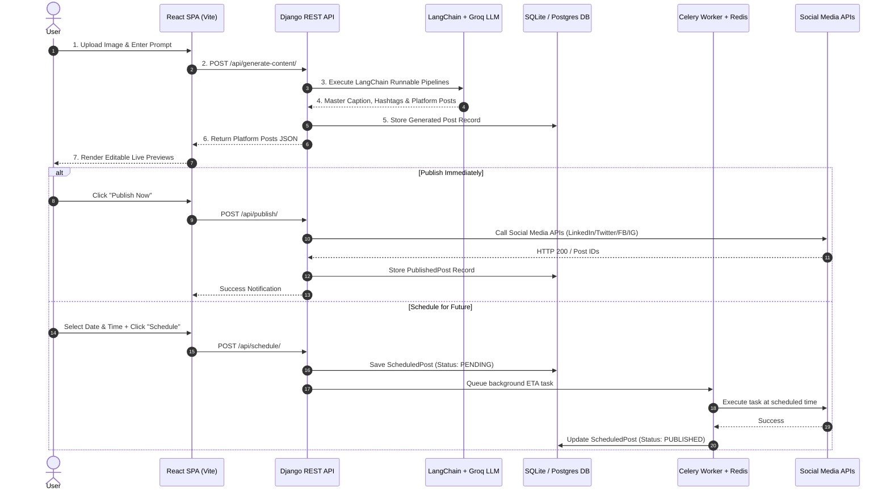

# SocialMediaAI — Master Project Blueprint & Technical Specification

> **An End-to-End AI-Powered Social Media Content Generation, Scheduling, Publishing & Multi-Platform Management System.**

---

## 🌟 Executive Summary

**SocialMediaAI** is a production-grade full-stack platform designed for content creators, digital marketers, and social media managers. It enables users to upload images, generate optimized platform-specific content (Twitter/X, Instagram, Facebook, LinkedIn) using Large Language Models (LLM), preview posts in real-time, connect social accounts via OAuth 2.0, publish immediately, or schedule dispatches asynchronously using Celery and Redis.

---

## 🖼️ Architecture & Deployment Visualizations

### 1. System Architecture Blueprint


### 2. AWS CI/CD Deployment Flow


---

## 🛠️ Complete Technology Stack

| Layer | Technologies & Frameworks |
| :--- | :--- |
| **Frontend UI** | React 19, Vite 8, React Router v7, Tailwind CSS v4, Lucide React, React Icons, React Hot Toast, Axios |
| **Backend REST API** | Python 3.11, Django 5.2, Django REST Framework, Django CORS Headers, WhiteNoise Static Storage |
| **Authentication** | Django SimpleJWT (JSON Web Tokens), Session Authentication |
| **Generative AI** | LangChain, LangChain Groq (`gsk_*`), Llama 3 LLM Models, Custom Prompt Templates |
| **Task Queue & Broker** | Celery 5.6, Redis 7 (Message Broker & Result Store) |
| **Database** | SQLite3 (Local Dev), PostgreSQL / Dj-Database-Url (Production ready) |
| **Image Processing** | Pillow (PIL), Django File/Image Storage |
| **Containerization** | Docker, Multi-Stage Dockerfile (Node 20 Alpine + Python 3.11 Slim) |
| **AWS Cloud Infrastructure** | AWS ECS Fargate, AWS ECR, AWS Application Load Balancer (ALB), AWS Secrets Manager, GitHub Actions |

---

## 💡 Advanced Design Patterns & Software Engineering Techniques

### 1. Factory & Provider Design Pattern (OAuth Engine)
- **Base Abstract Provider**: [`BaseOAuthProvider`](file:///c:/Users/xx/SocialMediaAI/backend/oauth/base_provider.py) defines the contract for authorization URL generation, code exchange, profile retrieval, and post publishing.
- **Concrete Providers**: [`LinkedInProvider`](file:///c:/Users/xx/SocialMediaAI/backend/oauth/providers/linkedin_provider.py), [`TwitterProvider`](file:///c:/Users/xx/SocialMediaAI/backend/oauth/providers/twitter_provider.py), [`FacebookProvider`](file:///c:/Users/xx/SocialMediaAI/backend/oauth/providers/facebook_provider.py), [`InstagramProvider`](file:///c:/Users/xx/SocialMediaAI/backend/oauth/providers/instagram_provider.py).
- **OAuth Factory**: [`OAuthFactory`](file:///c:/Users/xx/SocialMediaAI/backend/oauth/oauth_factory.py) dynamically instantiates and retrieves the appropriate provider at runtime based on the target platform string.

### 2. Service Layer Architecture
Separates business logic from HTTP view controllers to ensure testability and reusable services:
- **LLM Service**: [`LLMService`](file:///c:/Users/xx/SocialMediaAI/backend/services/llm.py) manages Groq AI client initialization and prompt execution.
- **Caption & Hashtag Services**: Orchestrate platform-specific content generation.
- **Publish & Social Media Services**: Standardizes post publishing across live API calls and mock fallbacks.
- **Schedule Service**: Controls post scheduling and status transitions (`pending`, `published`, `failed`).

### 3. LangChain Runnable Pipelines
- Uses composable LangChain pipelines to chain prompts, LLMs, and output parsers.
- Dynamically adapts master captions to platform constraints (e.g., 280-character limit for Twitter, professional markdown for LinkedIn, visual caption + hashtag blocks for Instagram).

### 4. Asynchronous Task Delegation (Celery + Redis)
- Time-consuming post publishing operations and scheduled posts run out-of-band via background worker processes.
- Celery Beat handles periodic cron checks for posts due for release.

### 5. Multi-Stage Unified Docker Build
- **Stage 1 (`node:20-alpine`)**: Installs Node dependencies and builds frontend static assets (`vite build`).
- **Stage 2 (`python:3.11-slim`)**: Copies compiled `frontend/dist` into Django's `frontend_dist`, collects static assets with WhiteNoise, and launches Gunicorn production server.

---

## 📂 Project Directory Structure

```text
SocialMediaAI/
│
├── backend/
│   ├── config/              # Django Settings, ASGI/WSGI, Celery setup
│   ├── core/                # Models, Serializers, Views, Tasks, URLs
│   ├── oauth/               # Provider Factory & OAuth Implementation
│   ├── prompts/             # LangChain Prompt Templates
│   ├── runnables/           # LangChain Runnable Pipelines
│   ├── services/            # Core Business Logic Services
│   ├── tools/               # Platform-specific Publishing Helpers
│   ├── frontend_dist/       # Production Compiled Frontend Assets
│   ├── manage.py
│   └── requirements.txt
│
├── frontend/
│   ├── src/
│   │   ├── components/      # Navbar, PostComposer, LivePreview, PlatformSelector
│   │   ├── pages/           # Dashboard, History, Settings, Analytics
│   │   ├── api/             # Axios API Client Instance
│   │   ├── App.jsx
│   │   └── index.css        # Design Tokens & Styles
│   ├── package.json
│   └── vite.config.js
│
├── .github/workflows/       # GitHub Actions AWS ECS Fargate Deployment
├── Dockerfile               # Production Multi-Stage Dockerfile
├── docker-compose.yml       # Multi-container Local Stack (Web, Celery, Redis)
├── task-def-latest.json     # AWS ECS Task Definition
└── README.md
```

---

## 🔄 End-to-End User Execution Flow



---

## 🚀 How to Run the Project

### Local Development Mode
1. **Start Django Backend**:
   ```bash
   cd backend
   ..\venv\Scripts\python.exe manage.py runserver 8000
   ```
2. **Start Vite Frontend**:
   ```bash
   cd frontend
   npm run dev
   ```
3. Access local UI at **`http://localhost:5173/`** or **`http://localhost:8000/`**.

### Production AWS ECS Deployment
- Pushing to branch `main` triggers GitHub Actions (`deploy.yml`).
- Builds multi-stage Docker container, pushes to Amazon ECR, and performs zero-downtime rolling update on AWS ECS Fargate.
